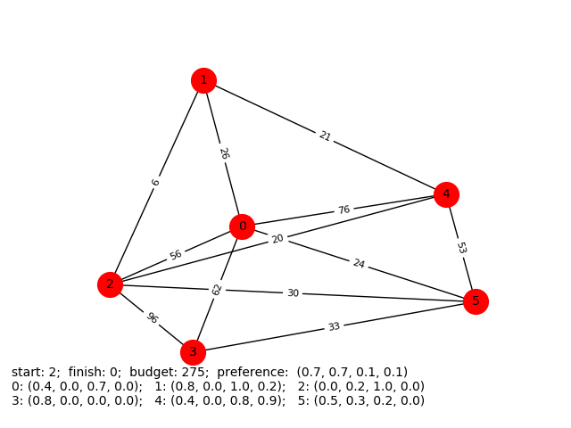
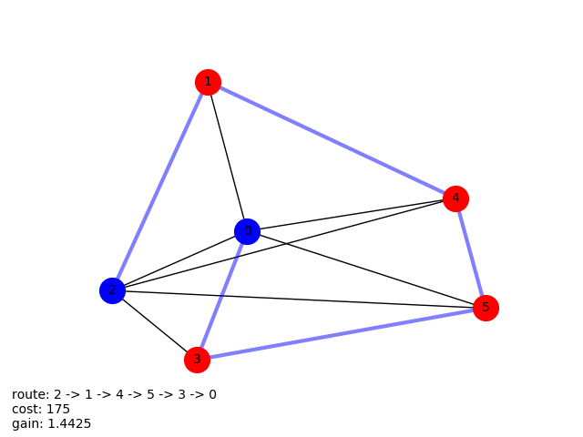
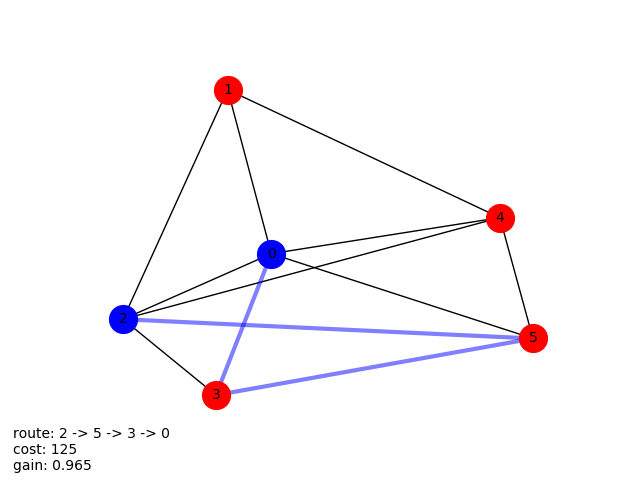

# PACER
### Constructing Top-k Routes with Personalized Submodular Maximization of POI (point of interest) Features
|              Graph               |              Route1              |               Route2             |
|:--------------------------------:|:--------------------------------:|:--------------------------------:|
|   |  |  |
|              Route3              |              Route4              |               Route5             |
|  |  |  |
***
## Problem description
We are given a collection of POIs (points of interest) with rated features and travelling costs between points. User wants to find top k routes from start to destination points, that maximally satisfy feature preferences and it's cost is not bigger than cost budget.
***
## Data
|             Graph1              |              Graph2             |              Graph3             |
|:-------------------------------:|:-------------------------------:|:-------------------------------:|
|  |  |  |

All data was generated in random way.
Number of POIs is in range from 5 to 8 and every edge has weights from 5 to 100.

Feature vectors for every POI are generated of size from 2 to 4.

User request is also generated by picking random source and destination points, cost budget and preference vector.
***
## Research
### Graph #1

|              Graph1              |              Route1              |
|:--------------------------------:|:--------------------------------:|
|   |  |
|              Route2              |              Route3              |
|  |  |
|              Route4              |              Route5              |
|  |  |

### Graph #2

|              Graph2              |              Route1              |
|:--------------------------------:|:--------------------------------:|
|   |  |
|              Route2              |              Route3              |
|  |  |
|              Route4              |              Route5              |
|  |  |

### Graph #3

|              Graph3              |              Route1              |
|:--------------------------------:|:--------------------------------:|
|   |  |
|              Route2              |              Route3              |
|  |  |
|              Route4              |              Route5              |
|  |  |
***
## Structure
***

> [resource](https://arxiv.org/pdf/1710.03852.pdf)

[Vasyl Borsuk](https://github.com/borsukvasyl) – borsuk@ucu.edu.ua

[Ivan Kosarevych](https://github.com/IvKosar) - kosarevych@ucu.edu.ua
