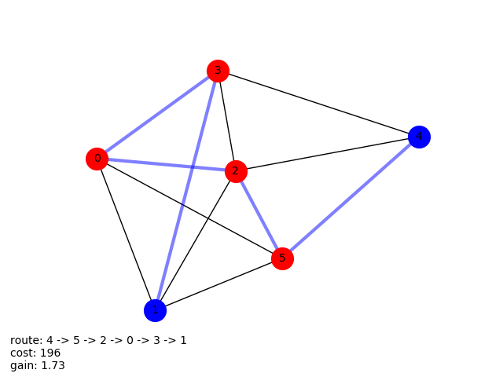

# PACER
#### Constructing Top-k Routes with Personalized Submodular Maximization of POI (point of interest) Features
|               Graph                 |              Result1                 |              Result2                 |
|:-----------------------------------:|:------------------------------------:|:------------------------------------:|
|  |  |  |
***
### Problem description
We are given a collection of POIs (points of interest) with rated features and travelling costs between points. User wants to find top k routes from start to destination points, that maximally satisfy feature preferences and it's cost is not bigger than cost budget.
***
### Data
***
### Research
***
### Structure
***

[resource](https://arxiv.org/pdf/1710.03852.pdf)

[Vasyl Borsuk](https://github.com/borsukvasyl) – borsuk@ucu.edu.ua
[Ivan Kosarevych](https://github.com/IvKosar) - kosarevych@ucu.edu.ua
